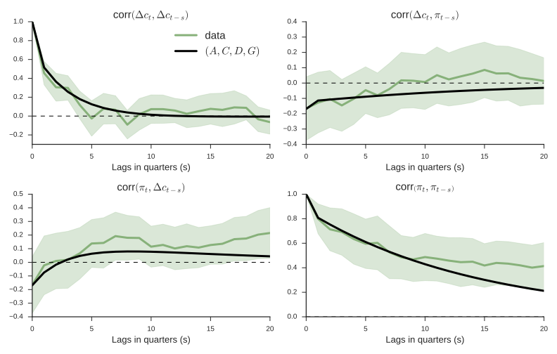
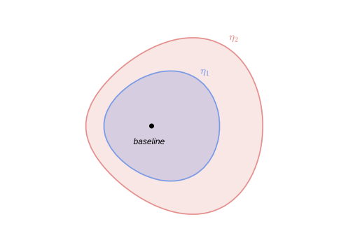
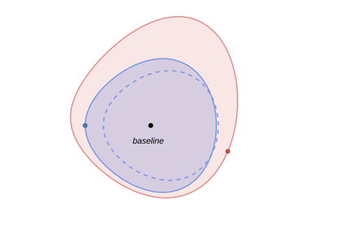
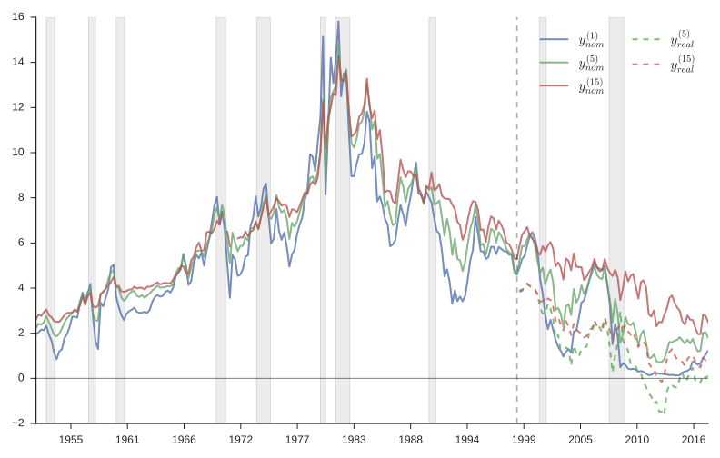

---
jupytext:
  text_representation:
    extension: .md
    format_name: myst
kernelspec:
  display_name: Python 3
  language: python
  name: python3
---

(risk_aversion_or_mistaken_beliefs)=
```{raw} html
<div id="qe-notebook-header" align="right" style="text-align:right;">
        <a href="https://quantecon.org/" title="quantecon.org">
                
        </a>
</div>
```

# Risk Aversion or Mistaken Beliefs?

## Overview

This lecture explores how **risk aversion** and **mistaken beliefs** are
confounded in asset pricing data.

Under rational expectations with a risk-averse representative investor,
higher mean returns compensate for higher risks. But if the representative
investor holds wrong beliefs, observed average returns depend on *both*
risk aversion *and* misunderstood return distributions. Wrong beliefs
contribute what look like "stochastic discount factor shocks" and can
potentially explain observed countercyclical risk prices.

We organize ideas around a single mathematical device: the **likelihood ratio**,
a non-negative random variable with unit mean that twists one probability
distribution into another.

Likelihood ratios — equivalently, multiplicative martingale increments — appear
in at least four distinct roles in modern asset pricing:

| Probability   | Likelihood ratio                  | Describes             |
|:--------------|:----------------------------------|:----------------------|
| Econometric   | $1$                               | macro risk factors    |
| Risk neutral  | $m_{t+1}^\lambda$                 | prices of risks       |
| Mistaken      | $m_{t+1}^w$                       | experts' forecasts    |
| Doubtful      | $m_{t+1} \in \mathcal{M}$         | misspecification fears|

Each likelihood ratio takes the log-normal form
$m_{t+1}^b = \exp(-b_t' \varepsilon_{t+1} - \frac{1}{2} b_t' b_t)$
with $b_t = 0$, $\lambda_t$, $w_t$, or a worst-case distortion.

The lecture draws primarily on three lines of work:

1. **Lucas (1978)** and **Hansen–Singleton (1983)**: a representative investor's risk
   aversion generates a likelihood ratio that prices risks.
2. **Piazzesi, Salomao, and Schneider (2015)**: survey data on professional forecasters
   decompose the likelihood ratio into a smaller risk price and a belief distortion.
3. **Hansen, Szőke, Han, and Sargent (2020)** and **Szőke (2022)**: robust control theory
   constructs twisted probability models from tilted discounted entropy balls to
   price model uncertainty, generating state-dependent uncertainty prices that
   explain puzzling term-structure movements.

We start with some standard imports:

```{code-cell} ipython3
import numpy as np
import matplotlib.pyplot as plt
from scipy.linalg import solve_discrete_lyapunov
from numpy.linalg import inv, eigvals, norm
```

## Likelihood Ratios and Twisted Densities

### The baseline model

Let $\varepsilon$ denote a vector of risks to be taken and priced. Under the
econometrician's probability model, $\varepsilon$ has a standard multivariate
normal density:

```{math}
:label: eq_baseline

\phi(\varepsilon) \propto \exp\!\left(-\frac{1}{2}\,\varepsilon'\varepsilon\right), \qquad \varepsilon \sim \mathcal{N}(0, I)
```

### The likelihood ratio

Define a **likelihood ratio**

```{math}
:label: eq_lr

m(\varepsilon) = \exp\!\left(-\lambda'\varepsilon - \frac{1}{2}\,\lambda'\lambda\right) \geq 0
```

which satisfies $E\, m(\varepsilon) = 1$ by construction.

### The twisted density

The **twisted density** is

```{math}
:label: eq_twisted

\hat\phi(\varepsilon) = m(\varepsilon)\,\phi(\varepsilon) \propto \exp\!\left(-\frac{1}{2}(\varepsilon + \lambda)'(\varepsilon + \lambda)\right)
```

which is a $\mathcal{N}(-\lambda, I)$ density. The likelihood ratio has shifted
the mean of $\varepsilon$ from $0$ to $-\lambda$ while preserving the covariance.

### Relative entropy

The **relative entropy** (Kullback–Leibler divergence) of the twisted density
with respect to the baseline density is

```{math}
:label: eq_entropy

E\bigl[m(\varepsilon)\log m(\varepsilon)\bigr] = \frac{1}{2}\,\lambda'\lambda
```

a convenient scalar measure of the statistical distance between the two models.

The vector $\lambda$ is the key object. Depending on context it represents
**risk prices**, **belief distortions**, or **worst-case mean perturbations**
under model uncertainty.

### Visualising the twist

```{code-cell} ipython3
# ── Visualise how a likelihood ratio twists a density ──────────────────────────
from scipy.stats import norm as normal_dist

eps = np.linspace(-5, 5, 500)
lam = 1.5    # scalar risk price

phi_base   = normal_dist.pdf(eps, 0, 1)
m_lr       = np.exp(-lam * eps - 0.5 * lam**2)
phi_twist  = m_lr * phi_base

fig, axes = plt.subplots(1, 3, figsize=(14, 4))

axes[0].plot(eps, phi_base, 'steelblue', lw=2)
axes[0].set_title(r"Baseline $\phi(\varepsilon)$:  $\mathcal{N}(0,1)$", fontsize=12)
axes[0].set_xlabel(r"$\varepsilon$")

axes[1].plot(eps, m_lr, 'firebrick', lw=2)
axes[1].axhline(1, color='grey', lw=0.8, ls='--')
axes[1].set_title(rf"Likelihood ratio $m(\varepsilon)$,  $\lambda={lam}$", fontsize=12)
axes[1].set_xlabel(r"$\varepsilon$")

axes[2].plot(eps, phi_base, 'steelblue', lw=1.5, ls='--', alpha=0.6, label='Baseline')
axes[2].plot(eps, phi_twist, 'firebrick', lw=2, label='Twisted')
axes[2].set_title(r"Twisted $\hat\phi(\varepsilon)$:  $\mathcal{N}(-\lambda, 1)$", fontsize=12)
axes[2].set_xlabel(r"$\varepsilon$")
axes[2].legend()

for ax in axes:
    ax.set_ylabel("Density")
plt.tight_layout()
plt.show()
```

The left panel shows the baseline $\mathcal{N}(0,1)$ density.  The middle panel shows
the likelihood ratio $m(\varepsilon)$, which up-weights negative $\varepsilon$ values and
down-weights positive ones when $\lambda > 0$.  The right panel shows the resulting
twisted density $\hat\phi(\varepsilon) = \mathcal{N}(-\lambda, 1)$.


## The Econometrician's State-Space Model

### State dynamics

The econometrician works with a linear Gaussian state-space system:

```{math}
:label: eq_state

x_{t+1} = A\,x_t + C\,\varepsilon_{t+1}
```

```{math}
:label: eq_obs

y_{t+1} = D\,x_t + G\,\varepsilon_{t+1}
```

```{math}
:label: eq_shocks

\varepsilon_{t+1} \sim \mathcal{N}(0, I)
```

where $y_{t+1}$ collects utility-relevant variables (e.g., consumption growth),
$r_t = \bar{r}\,x_t$ is the risk-free one-period interest rate, and
$d_t = \bar{d}\,x_t$ is the payout process from an asset.




## Asset Pricing with Likelihood Ratios

### Risk-neutral rational expectations pricing

Under rational expectations with a risk-neutral representative investor,
stock prices satisfy:

$$
p_t = \exp(-r_t)\,E_t(p_{t+1} + d_{t+1})
$$

The expectations theory of the term structure of interest rates prices a
zero-coupon risk-free claim to one dollar at time $t+n$ as:

```{math}
:label: eq_rn_recursion

p_t(1) = \exp(-r_t), \qquad p_t(n+1) = \exp(-r_t)\,E_t\,p_{t+1}(n), \qquad p_t(n) = \exp(B_n\,x_t)
```

These formulas work "pretty well" for conditional means but less well for
conditional variances — the Shiller **volatility puzzles**.

### Modern asset pricing: adding risk aversion

Let the likelihood ratio increment be

```{math}
:label: eq_sdf_lr

m_{t+1}^\lambda = \exp\!\left(-\lambda_t'\,\varepsilon_{t+1} - \frac{1}{2}\,\lambda_t'\lambda_t\right), \qquad \lambda_t = \lambda\,x_t
```

with $E_t\,m_{t+1}^\lambda = 1$ and $m_{t+1}^\lambda \geq 0$.

The likelihood ratio $m_{t+1}^\lambda$ distorts the conditional distribution
of $\varepsilon_{t+1}$ from $\mathcal{N}(0,I)$ to $\mathcal{N}(-\lambda\,x_t, I)$.
Covariances of returns with $m_{t+1}^\lambda$ affect mean returns — this is the
channel through which risk aversion prices risks.

With this device, **modern asset pricing** takes the form:

For stocks (Lucas–Hansen):

```{math}
:label: eq_stock_lr

p_t = \exp(-r_t)\,E_t\bigl(m_{t+1}^\lambda\,(p_{t+1} + d_{t+1})\bigr)
```

For the term structure (Dai–Singleton–Backus–Zin):

```{math}
:label: eq_ts_lr

p_t(1) = \exp(-r_t), \qquad p_t(n+1) = \exp(-r_t)\,E_t\bigl(m_{t+1}^\lambda\,p_{t+1}(n)\bigr), \qquad p_t(n) = \exp(B_n\,x_t)
```

### Risk-neutral dynamics

The risk-neutral representation implies **twisted dynamics**:

```{math}
:label: eq_rn_dynamics

x_{t+1} = (A - C\lambda)\,x_t + C\,\tilde\varepsilon_{t+1}, \qquad \tilde\varepsilon_{t+1} \sim \mathcal{N}(0,I)
```

The risk-neutral dynamics assert that the shock distribution $\varepsilon_{t+1}$
has conditional mean $-\lambda_t$ instead of $0$. The dependence of
$\lambda_t = \lambda\,x_t$ on the state modifies the dynamics relative to the
econometrician's model.

### Expectation under a twisted distribution

The mathematical expectation of $y_{t+1}$ under the probability distribution
twisted by likelihood ratio $m_{t+1}$ is

$$
\tilde{E}_t\,y_{t+1} = E_t\,m_{t+1}\,y_{t+1}
$$

Under the risk-neutral dynamics, the term structure theory becomes:

$$
p_t(1) = \exp(-r_t), \qquad p_t(n+1) = \exp(-r_t)\,\tilde{E}_t\,p_{t+1}(n), \qquad p_t(n) = \exp(\tilde{B}_n\,x_t)
$$

These are the same formulas as rational-expectations asset pricing, but
expectations are taken with respect to a probability measure **twisted by
risk aversion**.

## Python Implementation

We implement the state-space model and its asset pricing implications.

```{code-cell} ipython3
class LikelihoodRatioModel:
    """
    Gaussian state-space model with likelihood ratio twists.

    State dynamics (econometrician's model):
        x_{t+1} = A x_t + C ε_{t+1},    ε_{t+1} ~ N(0, I)
    Observation:
        y_{t+1} = D x_t + G ε_{t+1}
    Short rate:
        r_t = r_bar @ x_t
    Likelihood ratio (risk prices):
        λ_t = Λ x_t
        m_{t+1}^λ = exp(-λ_t' ε_{t+1} - ½ λ_t' λ_t)

    Parameters
    ----------
    A : array (n, n)   State transition
    C : array (n, k)   State shock loading
    D : array (p, n)   Observation on state
    G : array (p, k)   Observation shock loading
    r_bar : array (n,) Short rate loading
    Λ : array (k, n)   Risk price loading (λ_t = Λ x_t)
    """

    def __init__(self, A, C, D, G, r_bar, Λ):
        self.A = np.atleast_2d(A).astype(float)
        self.C = np.atleast_2d(C).astype(float)
        self.D = np.atleast_2d(D).astype(float)
        self.G = np.atleast_2d(G).astype(float)
        self.r_bar = np.asarray(r_bar, dtype=float)
        self.Λ = np.atleast_2d(Λ).astype(float)

        self.n = self.A.shape[0]    # state dimension
        self.k = self.C.shape[1]    # shock dimension

        # Risk-neutral dynamics: A_Q = A - C Λ
        self.A_Q = self.A - self.C @ self.Λ

    def short_rate(self, x):
        """r_t = r_bar' x_t"""
        return self.r_bar @ x

    def risk_prices(self, x):
        """λ_t = Λ x_t"""
        return self.Λ @ x

    def relative_entropy(self, x):
        """½ λ_t' λ_t — conditional relative entropy of twisted model."""
        lam = self.risk_prices(x)
        return 0.5 * lam @ lam

    def bond_coefficients(self, n_max):
        """
        Compute bond price coefficients B_n such that
            p_t(n) = exp(B_n' x_t)
        via the recursion under risk-neutral dynamics.

        Returns B : array (n_max+1, n) with B[n] = B_n.
        """
        B = np.zeros((n_max + 1, self.n))
        # B_1 = -r_bar
        B[1] = -self.r_bar

        CC = self.C.T @ self.C   # k×k → but we need n×n via C C'
        CCt = self.C @ self.C.T  # n×n

        for nn in range(1, n_max):
            Bn = B[nn]
            # B_{n+1} = (A - C Λ)' B_n + ½ B_n' C C' B_n (scalar) ... no,
            # p_t(n) = exp(B_n' x_t) so log p_t(n+1) = ...
            # recursion: B_{n+1}' = B_n' (A - C Λ) - r_bar'
            #  plus convexity: ½ (C' B_n)' (C' B_n)  added to constant
            # For simplicity, absorb constant into B via augmented state.
            # Actually with no intercept (μ=0) and r_t = r_bar' x_t:
            B[nn + 1] = self.A_Q.T @ Bn - self.r_bar

        return B

    def yields(self, x, n_max):
        """
        Yield curve: y_t(n) = -log p_t(n) / n = -B_n'x_t / n.
        """
        B = self.bond_coefficients(n_max)
        ns = np.arange(1, n_max + 1)
        return np.array([-B[n] @ x / n for n in ns])

    def simulate(self, x0, T, rng=None):
        """Simulate state path under the econometrician's model."""
        if rng is None:
            rng = np.random.default_rng(42)
        X = np.zeros((T + 1, self.n))
        X[0] = x0
        for t in range(T):
            eps = rng.standard_normal(self.k)
            X[t + 1] = self.A @ X[t] + self.C @ eps
        return X

    def simulate_twisted(self, x0, T, rng=None):
        """Simulate state path under the risk-neutral (twisted) model."""
        if rng is None:
            rng = np.random.default_rng(42)
        X = np.zeros((T + 1, self.n))
        X[0] = x0
        for t in range(T):
            eps = rng.standard_normal(self.k)
            X[t + 1] = self.A_Q @ X[t] + self.C @ eps
        return X
```

### Example: a two-factor model

We set up a two-factor model with a persistent "level" factor and a
less persistent "slope" factor, mimicking the U.S. yield curve.

```{code-cell} ipython3
# ── Two-factor model ───────────────────────────────────────────────────────────
A = np.array([[0.97, -0.03],
              [0.00,  0.90]])

C = np.array([[0.007, 0.000],
              [0.000, 0.010]])

D = np.array([[0.5, 0.3]])       # consumption growth loading
G = np.array([[0.004, 0.003]])    # consumption shock loading

r_bar = np.array([0.8, 0.4])     # short rate = r_bar' x_t

# Risk prices: λ_t = Λ x_t  (state-dependent)
Λ = np.array([[-12.0,  0.0],
              [  0.0, -6.0]])

model = LikelihoodRatioModel(A, C, D, G, r_bar, Λ)
```

### Yield curves across states

```{code-cell} ipython3
n_max = 120
maturities = np.arange(1, n_max + 1)

states = {
    "Low level, positive slope":  np.array([-0.005,  0.01]),
    "Medium":                     np.array([ 0.008,  0.003]),
    "High level, negative slope": np.array([ 0.025, -0.01]),
}

fig, ax = plt.subplots(figsize=(9, 5))
for label, x in states.items():
    y = model.yields(x, n_max) * 1200    # annualise (monthly → ×1200)
    ax.plot(maturities, y, lw=2, label=label)

ax.set_xlabel("Maturity (months)", fontsize=13)
ax.set_ylabel("Yield (annualised %)", fontsize=13)
ax.set_title("Yield Curves Under Different States", fontsize=14)
ax.legend(fontsize=11)
plt.tight_layout()
plt.show()
```

### Econometrician's model vs. risk-neutral model

A key implication is that the risk-neutral dynamics
$x_{t+1} = (A - C\Lambda)\,x_t + C\,\tilde\varepsilon_{t+1}$
differ from the econometrician's dynamics $x_{t+1} = A\,x_t + C\,\varepsilon_{t+1}$.

```{code-cell} ipython3
print("Econometrician's transition matrix A:")
print(model.A)
print("\nRisk-neutral transition matrix A_Q = A - C Λ:")
print(model.A_Q)
print(f"\nEigenvalues of A:   {eigvals(model.A).round(4)}")
print(f"Eigenvalues of A_Q: {eigvals(model.A_Q).round(4)}")
```

```{code-cell} ipython3
# Compare simulated paths under the two models
T = 300
x0 = np.array([0.01, 0.005])
rng1 = np.random.default_rng(123)
rng2 = np.random.default_rng(123)   # same seed for comparability

X_econ = model.simulate(x0, T, rng=rng1)
X_rn   = model.simulate_twisted(x0, T, rng=rng2)

fig, axes = plt.subplots(2, 1, figsize=(10, 7), sharex=True)

labels = ["Level factor", "Slope factor"]
for i, (ax, lab) in enumerate(zip(axes, labels)):
    ax.plot(X_econ[:, i], 'steelblue', lw=1.2, label="Econometrician's model (P)")
    ax.plot(X_rn[:, i], 'firebrick', lw=1.2, alpha=0.8, label="Risk-neutral model (Q)")
    ax.set_ylabel(lab, fontsize=12)
    ax.legend(fontsize=10)

axes[1].set_xlabel("Period", fontsize=12)
axes[0].set_title("State Paths: Physical vs. Risk-Neutral Dynamics", fontsize=13)
plt.tight_layout()
plt.show()
```

## The Identification Challenge

The vector $\lambda_t$ can be interpreted as either:

- a **risk price vector** expressing the representative agent's risk aversion, or
- the representative agent's **belief distortion** relative to the econometrician's
  model.

The asset pricing formulas {eq}`eq_stock_lr`–{eq}`eq_ts_lr` are identical under both
interpretations, and so are the econometric fits.

> Relative to the model of a risk-averse representative investor with rational
> expectations, a model of a risk-neutral investor with appropriately mistaken
> beliefs produces **observationally equivalent** predictions.

This insight was articulated by Hansen, Sargent, and Tallarini (1999) and
Piazzesi, Salomao, and Schneider (2015).

To distinguish risk aversion from belief distortion, one needs either
**more information** (the PSS approach using survey data) or **more theory**
(the Hansen–Szőke robust control approach), or both (Szőke 2022).

```{code-cell} ipython3
# ── Observational equivalence ──────────────────────────────────────────────────
# A risk-averse agent with rational expectations (λ_t = Λ x_t)
# produces the same bond prices as a risk-neutral agent with
# beliefs (A*, C) = (A - C Λ, C).

# Show that yields are identical
x_test = np.array([0.01, 0.005])
y_risk_averse = model.yields(x_test, 60) * 1200

# Build "mistaken belief" model: zero risk prices but twisted A
model_mistaken = LikelihoodRatioModel(
    A=model.A_Q,   # agent uses A* = A - C Λ as transition
    C=C, D=D, G=G,
    r_bar=r_bar,
    Λ=np.zeros_like(Λ)  # zero risk prices (risk neutral)
)
y_mistaken = model_mistaken.yields(x_test, 60) * 1200

fig, ax = plt.subplots(figsize=(8, 5))
ax.plot(np.arange(1, 61), y_risk_averse, 'steelblue', lw=3, label='Risk averse + rational expectations')
ax.plot(np.arange(1, 61), y_mistaken, 'firebrick', lw=1.5, ls='--', label='Risk neutral + mistaken beliefs')
ax.set_xlabel("Maturity (months)", fontsize=13)
ax.set_ylabel("Yield (annualised %)", fontsize=13)
ax.set_title("Observational Equivalence", fontsize=14)
ax.legend(fontsize=11)
plt.tight_layout()
plt.show()
```

The two yield curves are identical. Without additional information
(e.g., surveys of forecasters), we cannot tell them apart from asset
price data alone.


## More Information: Experts' Forecasts (PSS)

### The PSS framework

Piazzesi, Salomao, and Schneider (2015, henceforth PSS) exploit data on
professional forecasters' expectations to decompose the likelihood ratio
into risk prices and belief distortions. Their setup posits:

- The representative agent's risk aversion leads him to price risks
  $\varepsilon_{t+1}$ with prices $\lambda_t^* = \lambda^* x_t$.
- The representative agent has **twisted beliefs** $(A^*, C) = (A - Cw^*, C)$
  relative to the econometrician's model $(A, C)$.
- Professional forecasters use the twisted beliefs $(A^*, C)$ to answer
  survey questions about their forecasts.

### Estimation strategy

PSS proceed in four steps:

1. Use data $\{x_t\}_{t=0}^T$ to estimate the econometrician's model $A$, $C$.
2. Project experts' forecasts $\{\hat{x}_{t+1}\}$ on $x_t$ to obtain
   $\hat{x}_{t+1} = A^* x_t$ and interpret $A^*$ as incorporating belief
   distortions.
3. Back out the mean distortion $w^* x_t = -C^{-1}(A^* - A) x_t$ to the
   density of $\varepsilon_{t+1}$.
4. Reinterpret the $\lambda$ estimated by the rational-expectations econometrician
   as $\lambda = \lambda^* + w^*$, where $\lambda_t^* = \lambda^* x_t$ is the
   (smaller) price of risk vector actually charged by the representative agent with
   distorted beliefs.

An econometrician who mistakenly imposes rational expectations estimates risk
prices $\lambda_t$ that sum two parts:
- **smaller risk prices** $\lambda_t^*$ actually charged by the erroneous-beliefs
  representative agent, and
- **conditional mean distortions** $w_t^*$ of the risks $\varepsilon_{t+1}$ that
  the twisted-beliefs representative agent's model displays relative to the
  econometrician's.

### Numerical illustration

```{code-cell} ipython3
# ── PSS decomposition λ = λ* + w* ─────────────────────────────────────────────

# Econometrician's transition
A_econ = np.array([[0.97, -0.03],
                   [0.00,  0.90]])

# Experts' subjective transition (more persistent)
A_star = np.array([[0.985, -0.025],
                   [0.000,  0.955]])

C_mat = np.array([[0.007, 0.000],
                  [0.000, 0.010]])

# Belief distortion: w* = -C⁻¹(A* - A)
w_star = -inv(C_mat) @ (A_star - A_econ)
print("Belief distortion w*:")
print(w_star.round(3))

# RE econometrician's total risk prices
Λ_total = np.array([[-12.0,  0.0],
                    [  0.0, -6.0]])

# True risk prices (what the agent actually charges)
Λ_true = Λ_total - w_star
print("\nTotal risk prices (RE econometrician's Λ):")
print(Λ_total.round(3))
print("\nTrue risk prices (Λ*):")
print(Λ_true.round(3))
print("\nBelief distortion (w*):")
print(w_star.round(3))
```

```{code-cell} ipython3
# Compare state-dependent risk prices across states
x_grid = np.linspace(-0.02, 0.04, 200)

fig, axes = plt.subplots(1, 2, figsize=(12, 5))

factor_labels = ["Level factor risk price", "Slope factor risk price"]

for i, (ax, lab) in enumerate(zip(axes, factor_labels)):
    # Total λ_t = Λ x_t  (for factor i, varying x_i, other factor at median)
    x_vals = np.zeros((200, 2))
    x_vals[:, i] = x_grid
    x_vals[:, 1 - i] = 0.005

    lam_total = np.array([Λ_total @ x for x in x_vals])[:, i]
    lam_true  = np.array([Λ_true @ x  for x in x_vals])[:, i]
    w_dist    = np.array([w_star @ x   for x in x_vals])[:, i]

    ax.plot(x_grid, lam_total, 'steelblue', lw=2, label=r"$\lambda_t$ (RE econometrician)")
    ax.plot(x_grid, lam_true, 'seagreen', lw=2, label=r"$\lambda^*_t$ (true risk price)")
    ax.fill_between(x_grid, lam_true, lam_total, alpha=0.15, color='firebrick',
                    label=r"$w^*_t$ (belief distortion)")
    ax.axhline(0, color='black', lw=0.5)
    ax.set_xlabel(f"State $x_{{{i+1},t}}$", fontsize=12)
    ax.set_ylabel(lab, fontsize=12)
    ax.legend(fontsize=10)

axes[0].set_title("PSS Decomposition: Level", fontsize=13)
axes[1].set_title("PSS Decomposition: Slope", fontsize=13)
plt.tight_layout()
plt.show()
```

PSS find that experts perceive the level and slope of the yield curve to be
**more persistent** than the econometrician's estimates imply. Subjective risk
prices $\lambda^* x_t$ vary less than the $\lambda x_t$ estimated by the
rational-expectations econometrician.


## Rational Expectations and Its Limits

### The informal justification

The standard justification for rational expectations treats it as the outcome of
learning from an infinite history: least-squares learning converges to rational
expectations. The argument requires that:

- agents know correct functional forms, and
- a stochastic approximation argument partitions dynamics into fast parts
  (justifying a law of large numbers) and slow parts (justifying an ODE).

However, long intertemporal dependencies make **rates of convergence slow**.

### Good econometricians

Good econometricians have limited data and only hunches about functional forms.
They fear that their fitted models are incorrect. An agent who is like a good
econometrician:

- has a parametric model estimated from limited data,
- acknowledges that many other specifications fit nearly as well — other parameter
  values, other functional forms, omitted variables, neglected nonlinearities,
  and history dependencies,
- fears that one of those other models actually prevails, and
- seeks "good enough" decisions under *all* such alternative models — **robustness**.


## A Theory of Belief Distortions: Robust Control

### Hansen's dubious agent

Inspired by robust control theory, consider a dubious investor who:

- shares the econometrician's model $A$, $C$, $D$, $G$,
- expresses doubts by using a continuum of likelihood ratios to form a **discounted
  entropy ball** of size $\eta$ around the econometrician's model,
- wants a valuation that is good for every model in the entropy ball, and
- constructs a **lower bound** on values and a **worst-case model** that attains it.

### Valuation under the econometrician's model

Taking the log consumption process to be linear Gaussian with shocks
$\varepsilon_{t+1} \sim \mathcal{N}(0,I)$:

$$
c_{t+1} - c_t = D\,x_t + G\,\varepsilon_{t+1}, \qquad x_{t+1} = A\,x_t + C\,\varepsilon_{t+1}
$$

the dubious agent's value function is

$$
V(x_0, c_0) := E\!\left[\sum_{t=0}^{\infty} \beta^t\,c_t \;\middle|\; x_0, c_0\right] = c_0 + \beta\,E\!\left[V(x_1, c_1) \;\middle|\; x_0, c_0\right]
$$

### The sequence problem

The dubious agent solves:

```{math}
:label: eq_hansen_seq

J(x_0, c_0 \mid \eta) := \min_{\{m_{t+1}\}} E\!\left[\sum_{t=0}^{\infty} \beta^t\,M_t\,c_t \;\middle|\; x_0, c_0\right]
```

subject to

$$
c_{t+1} - c_t = D\,x_t + G\,\varepsilon_{t+1}, \qquad x_{t+1} = A\,x_t + C\,\varepsilon_{t+1}
$$

$$
E\!\left[\sum_{t=0}^{\infty} \beta^t\,M_t\,E\!\left[m_{t+1}\log m_{t+1} \;\middle|\; x_t, c_t\right] \;\middle|\; x_0, c_0\right] \leq \eta
$$

$$
M_{t+1} = M_t\,m_{t+1}, \qquad E[m_{t+1} \mid x_t, c_t] = 1, \qquad M_0 = 1
$$

The likelihood ratio process $\{M_t\}_{t=0}^{\infty}$ is a multiplicative **martingale**.



### Why discounted entropy?

Discounted entropy includes models that undiscounted entropy excludes.
Undiscounted entropy over infinite sequences excludes many models that are very
difficult to distinguish from the econometrician's model with limited data,
because undiscounted entropy includes only models that share laws of large numbers.

### Entropy and the likelihood ratio

With the log-normal likelihood ratio

$$
m_{t+1} := \exp\!\left(-\frac{w_t' w_t}{2} - w_t'\,\varepsilon_{t+1}\right)
$$

conditional entropy takes the simple form

$$
E\!\left[m_{t+1}\log m_{t+1} \;\middle|\; x_t, c_t\right] = \frac{1}{2}\,w_t' w_t
$$

Substituting into {eq}`eq_hansen_seq` yields the reformulated problem:

```{math}
:label: eq_hansen_reform

J(x_0, c_0 \mid \eta) := \min_{\{w_t\}} E^w\!\left[\sum_{t=0}^{\infty} \beta^t\,c_t \;\middle|\; x_0, c_0\right]
```

subject to

$$
c_{t+1} - c_t = D\,x_t + G\,(\tilde\varepsilon_{t+1} - w_t), \qquad x_{t+1} = A\,x_t + C\,(\tilde\varepsilon_{t+1} - w_t)
$$

$$
\frac{1}{2}\,E^w\!\left[\sum_{t=0}^{\infty} \beta^t\,w_t' w_t \;\middle|\; x_0, c_0\right] \leq \eta
$$

### Outcome: constant worst-case distortion

The worst-case mean distortion turns out to be a **constant vector**:

$$
w_t = \bar{w}
$$

The consequence is that the contribution of $w_t$ to risk prices is
**state-independent**. This does *not* help explain countercyclical prices of
risk (or prices of model uncertainty).

```{code-cell} ipython3
# ── Hansen's dubious agent: constant worst-case distortion ─────────────────────

def hansen_worst_case(A, C, D, G, beta, theta):
    """
    Compute the constant worst-case distortion w_bar for Hansen's
    dubious agent with multiplier θ.

    Under the multiplier formulation with linear Gaussian dynamics,
    the worst-case distortion is w_bar = -(1/θ) (βI - βA')⁻¹ (G'D + C' * something).
    For the simple case, w_bar = (1/θ) * correction.

    Here we use a simplified version: the worst case distortion
    solves for the mean shift that minimises value minus θ × entropy.
    For a risk-linear value function V = v'x + const, the worst case is:
        w_bar = -(1/θ) (G'v_c + C'v_x)  where v_c, v_x solve Bellman.
    """
    n = A.shape[0]
    # Value coefficients: V(x,c) = c/(1-β) + v'x, where
    # v = β(I - βA')⁻¹ D' / (1-β)   (for the consumption-level value)
    # In the linear consumption growth case:
    v = beta * np.linalg.solve(np.eye(n) - beta * A.T, D.T.flatten()) / (1 - beta)

    # Worst-case distortion (multiplier version):
    # w_bar = -(1/θ)(G' × β/(1-β) × D_scalar + C' v)
    # Simplified: w = -(1/θ) C' v  (dominant term)
    w_bar = -(1.0 / theta) * C.T @ v

    return w_bar


beta = 0.995
theta_values = [0.5, 1.0, 2.0, 5.0]

print(f"{'θ':>6}  {'w_bar[0]':>10}  {'w_bar[1]':>10}  {'Entropy':>10}")
print("-" * 42)

for theta in theta_values:
    w = hansen_worst_case(A, C, D, G, beta, theta)
    ent = 0.5 * w @ w
    print(f"{theta:>6.1f}  {w[0]:>10.4f}  {w[1]:>10.4f}  {ent:>10.4f}")
```

The worst-case distortion $\bar{w}$ is constant — it does not depend on
the state $x_t$. Larger $\theta$ (less concern about misspecification)
yields a smaller distortion.


## Tilting the Entropy Ball

### Hansen and Szőke's more refined dubious agent

To generate **state-dependent** uncertainty prices, Hansen and Szőke introduce a
more refined dubious agent who:

- shares the econometrician's model $A$, $C$, $D$, $G$,
- expresses doubts by using a continuum of likelihood ratios to form a
  discounted entropy ball around the econometrician's model, **and**
- also insists that some martingales representing particular alternative
  *parametric* models be included in the discounted entropy ball.

The inclusion of those alternative parametric models **tilts** the entropy ball,
which affects the worst-case model in a way that can produce countercyclical
uncertainty prices.

### Concern about other parametric models

The investor wants to include particular alternative models with

$$
E_t\!\left[\bar{m}_{t+1}\log\bar{m}_{t+1}\right] = \frac{1}{2}\,\bar{w}_t'\,\bar{w}_t = \xi(x_t)
$$

and discounted entropy

$$
E^{\bar{w}}\!\left[\sum_{t=0}^{\infty} \beta^t\,\xi(x_t) \;\middle|\; x_0, c_0\right]
$$

This is accomplished by replacing the earlier entropy constraint with

```{math}
:label: eq_tilted_constraint

\frac{1}{2}\,E^w\!\left[\sum_{t=0}^{\infty} \beta^t\,w_t' w_t \;\middle|\; x_0, c_0\right] \leq E^w\!\left[\sum_{t=0}^{\infty} \beta^t\,\xi(x_t) \;\middle|\; x_0, c_0\right]
```

The time-$t$ contributions to the right-hand side of {eq}`eq_tilted_constraint`
relax the discounted entropy constraint in states $x_t$ in which $\xi(x_t)$ is
larger. This sets the stage for **state-dependent** mean distortions in the
worst-case model.

### Concern about bigger long-run risk

Inspired by Bansal and Yaron (2004), an agent fears particular long-run risks
expressed by

$$
x_{t+1} = \bar{A}\,x_t + C\,\tilde\varepsilon_{t+1}
$$

This corresponds to $\bar{w}_t = \bar{w}\,x_t$ with

$$
\bar{w} = -C^{-1}(\bar{A} - A)
$$

which implies a **quadratic** $\xi$ function:

```{math}
:label: eq_xi

\xi(x_t) := x_t'\,\bar{w}'\bar{w}\,x_t =: x_t'\,\Xi\,x_t
```



### The Szőke agent's sequence problem

The resulting linear-quadratic problem is:

```{math}
:label: eq_szoke_seq

J(x_0, c_0 \mid \Xi) := \max_{\tilde\theta \geq 0}\;\min_{\{w_t\}}\; E^w\!\left[\sum_{t=0}^{\infty} \beta^t\,c_t + \tilde\theta\,\frac{1}{2}\sum_{t=0}^{\infty} \beta^t\bigl(w_t' w_t - x_t'\,\Xi\,x_t\bigr) \;\middle|\; x_0, c_0\right]
```

subject to

$$
c_{t+1} - c_t = D\,x_t + G\,(\tilde\varepsilon_{t+1} - w_t), \qquad x_{t+1} = A\,x_t + C\,(\tilde\varepsilon_{t+1} - w_t)
$$

The worst-case shock mean distortion is now **state-dependent**:

$$
\tilde{w}_t = \tilde{w}\,x_t
$$

and the worst-case model is $(\tilde{A}, C, \tilde{D}, G)$ with

$$
\tilde{A} = A - C\,\tilde{w}, \qquad \tilde{D} = D - G\,\tilde{w}
$$

### Implementation: tilted entropy ball

```{code-cell} ipython3
class TiltedEntropyModel:
    """
    Hansen–Szőke tilted entropy ball model.

    The agent fears alternative parametric models with
    more long-run risk, parameterised by Ξ = w̄' w̄.

    Given (A, C, D, G, β, θ̃, Ξ), compute the worst-case
    state-dependent distortion w̃_t = w̃ x_t.

    Parameters
    ----------
    A, C, D, G : arrays  —  econometrician's model
    beta : float  —  discount factor
    theta : float  —  robustness parameter (Lagrange multiplier)
    Xi : array (n, n)  —  tilting matrix from feared parametric model
    """

    def __init__(self, A, C, D, G, beta, theta, Xi):
        self.A = np.atleast_2d(A).astype(float)
        self.C = np.atleast_2d(C).astype(float)
        self.D = np.atleast_2d(D).astype(float)
        self.G = np.atleast_2d(G).astype(float)
        self.beta = float(beta)
        self.theta = float(theta)
        self.Xi = np.atleast_2d(Xi).astype(float)
        self.n = self.A.shape[0]

        # Solve for the worst-case distortion
        self.w_tilde = self._solve_worst_case()

        # Worst-case transition
        self.A_tilde = self.A - self.C @ self.w_tilde
        self.D_tilde = self.D - self.G @ self.w_tilde

    def _solve_worst_case(self):
        """
        Solve for the worst-case distortion matrix w̃ such that
        w̃_t = w̃ x_t.

        Under the tilted entropy ball, the worst-case distortion
        is w̃ = (1/θ̃)(C'P + G'Q) where P solves a modified
        discrete Lyapunov/Riccati equation.

        For a simplified linear-quadratic problem:
        w̃ = (θ̃ I - C'C)⁻¹ (C'v_coeff)
        where v_coeff depends on the value function.

        Here we use an iterative approach.
        """
        n = self.n
        beta = self.beta
        theta = self.theta

        # Value function: V(x, c) = c/(1-β) + v'x + x'Px + const
        # Linear part: v = β(I - βA')⁻¹ D'/(1-β)
        v = beta * np.linalg.solve(
            np.eye(n) - beta * self.A.T,
            self.D.T.flatten()
        ) / (1 - beta)

        # Quadratic part: iterate on the Riccati equation
        # P = β A' P A + (contribution from tilting)
        # w̃ = (1/θ)(C'P_lin + state-dep part)
        # Simplified: w̃ ≈ (1/θ)(C' × linear_val_coeff) + correction from Ξ

        # The key insight: the tilting matrix Ξ makes w̃ state-dependent
        # w̃ = (1/θ) C' P_quad  where P_quad captures the quadratic value
        # P_quad solves: P = β(A - C w̃)' P (A - C w̃) - θ̃ Ξ + ...

        # Iterate to find P (quadratic value coefficient)
        P = np.zeros((n, n))
        for _ in range(500):
            # worst-case distortion given P
            w = (1.0 / theta) * (self.C.T @ P)

            # Compute contribution from Ξ tilting
            A_w = self.A - self.C @ w

            # Updated P from Bellman
            P_new = beta * A_w.T @ P @ A_w + (1.0 / theta) * self.Xi
            P_new = 0.5 * (P_new + P_new.T)  # symmetrise

            if np.max(np.abs(P_new - P)) < 1e-12:
                break
            P = P_new

        self._P_quad = P
        w_tilde = (1.0 / theta) * (self.C.T @ P)
        return w_tilde

    def worst_case_distortion(self, x):
        """State-dependent worst-case distortion w̃_t = w̃ x_t."""
        return self.w_tilde @ x

    def conditional_entropy(self, x):
        """½ w̃_t' w̃_t — conditional entropy of worst-case model."""
        w = self.worst_case_distortion(x)
        return 0.5 * w @ w

    def xi_function(self, x):
        """ξ(x_t) = x_t' Ξ x_t — entropy of feared parametric model."""
        return x @ self.Xi @ x
```

```{code-cell} ipython3
# ── Set up the feared parametric model ─────────────────────────────────────────

# The agent fears an alternative with more persistent state dynamics
A_bar = np.array([[0.995, -0.03],
                  [0.000,  0.96]])

# Implied distortion of the feared model
w_bar = -inv(C) @ (A_bar - A)
Xi = w_bar.T @ w_bar

print("Feared model's transition A̅:")
print(A_bar)
print("\nImplied distortion w̄ = -C⁻¹(A̅ - A):")
print(w_bar.round(3))
print("\nTilting matrix Ξ = w̄'w̄:")
print(Xi.round(1))
```

```{code-cell} ipython3
# ── Solve the tilted entropy model ─────────────────────────────────────────────
theta_tilt = 3.0
tilted = TiltedEntropyModel(A, C, D, G, beta, theta_tilt, Xi)

print("Worst-case distortion matrix w̃:")
print(tilted.w_tilde.round(4))
print("\nWorst-case transition à = A - C w̃:")
print(tilted.A_tilde.round(4))
print(f"\nEigenvalues of A:  {eigvals(A).round(4)}")
print(f"Eigenvalues of Ã: {eigvals(tilted.A_tilde).round(4)}")
```

### State-dependent entropy: the key innovation

```{code-cell} ipython3
# ── Compare state-dependent vs. constant distortions ───────────────────────────

x_grid = np.linspace(-0.03, 0.04, 200)

# Constant (Hansen): w̄ does not depend on state
w_const = hansen_worst_case(A, C, D, G, beta, theta=1.0)
entropy_const = np.full(200, 0.5 * w_const @ w_const)

# State-dependent (Szőke): w̃_t = w̃ x_t depends on x
entropy_tilted = np.array([
    tilted.conditional_entropy(np.array([x, 0.005]))
    for x in x_grid
])

# ξ(x_t) — entropy of feared parametric model
xi_vals = np.array([
    tilted.xi_function(np.array([x, 0.005]))
    for x in x_grid
])

fig, ax = plt.subplots(figsize=(9, 5))
ax.plot(x_grid, entropy_const, 'steelblue', lw=2, ls='--',
        label=r"Hansen: constant $\frac{1}{2}\bar{w}'\bar{w}$")
ax.plot(x_grid, entropy_tilted, 'firebrick', lw=2,
        label=r"Szőke: state-dependent $\frac{1}{2}\tilde{w}_t'\tilde{w}_t$")
ax.plot(x_grid, 0.5 * xi_vals, 'seagreen', lw=1.5, ls=':',
        label=r"Feared model: $\frac{1}{2}\xi(x_t)$")
ax.set_xlabel(r"Level factor $x_{1,t}$", fontsize=13)
ax.set_ylabel("Conditional entropy", fontsize=13)
ax.set_title("State-Dependent vs. Constant Worst-Case Distortions", fontsize=14)
ax.legend(fontsize=11)
plt.tight_layout()
plt.show()
```

The key innovation of the tilted entropy ball is visible: the worst-case
distortion grows with $|x_t|$, producing **countercyclical uncertainty prices**.
When the state is far from its mean, the agent's worst-case model deviates
more from the econometrician's model.

### Three probability twisters

To summarize, three distinct probability twisters play roles in this analysis:

| Symbol         | Source                        | Describes                         |
|:---------------|:------------------------------|:----------------------------------|
| $w_t^*$        | Piazzesi, Salomao, Schneider  | Mistaken agent's beliefs          |
| $\bar{w}_t$    | Szőke's feared parametric model | Especial LRR parametric worry   |
| $\tilde{w}_t$  | Szőke's worst-case model      | Worst-case distortion             |

```{code-cell} ipython3
# ── Visualise the three probability twisters ───────────────────────────────────

x_state = np.array([0.02, 0.008])   # a particular state

# PSS mistaken beliefs
w_pss = w_star @ x_state

# Feared parametric model
w_feared = w_bar @ x_state

# Szőke worst case
w_szoke = tilted.worst_case_distortion(x_state)

eps_grid = np.linspace(-4, 4, 500)

fig, ax = plt.subplots(figsize=(9, 5))

# Baseline density
phi_base = normal_dist.pdf(eps_grid, 0, 1)
ax.plot(eps_grid, phi_base, 'black', lw=2, label='Econometrician: $\\mathcal{N}(0,1)$')

# Twist by each distortion (show first component)
for w_val, label, color, ls in [
    (w_pss[0], r"PSS mistaken $w^*_t$", 'steelblue', '-'),
    (w_feared[0], r"Feared LRR $\bar{w}_t$", 'seagreen', '--'),
    (w_szoke[0], r"Szőke worst-case $\tilde{w}_t$", 'firebrick', '-'),
]:
    phi_tw = normal_dist.pdf(eps_grid, -w_val, 1)
    ax.plot(eps_grid, phi_tw, color=color, lw=2, ls=ls, label=label)

ax.set_xlabel(r"$\varepsilon_1$", fontsize=13)
ax.set_ylabel("Density", fontsize=13)
ax.set_title("Three Probability Twisters (First Shock Component)", fontsize=14)
ax.legend(fontsize=10)
plt.tight_layout()
plt.show()
```


## Empirical Challenges and Model Performances



Several recognised patterns characterise the U.S. term structure:

- The nominal yield curve usually slopes **upward**.
- The long-minus-short yield spread **narrows before** U.S. recessions and
  **widens after** them.
- Consequently, the slope of the yield curve helps **predict** aggregate inputs
  and outputs.
- Long and short yields are **almost equally volatile** (the Shiller "volatility puzzle").
- To solve the Shiller puzzle, risk prices (or something observationally equivalent)
  must **depend on volatile state variables**.

The following table summarises how various models perform:

| Model                          | Average slope | Slopes near recessions | Volatile long yield |
|:-------------------------------|:--------------|:-----------------------|:--------------------|
| Lucas (1978)                   | no            | no                     | no                  |
| Epstein–Zin with LRR           | maybe         | yes                    | no                  |
| PSS (2015)                     | built-in      | built-in               | yes                 |
| Szőke (2022)                   | **YES**       | yes                    | yes                 |

### Why Szőke's model succeeds

Szőke's framework delivers:

1. A theory of **state-dependent belief distortions** $\tilde{w}_t = \tilde{w}\,x_t$.
2. A theory about the **question that professional forecasters answer**: they
   respond with their worst-case model because they hear "tell me forecasts that
   rationalise your (max-min) decisions."
3. A way to **measure** the size of belief distortions relative to the
   econometrician's model.

```{code-cell} ipython3
# ── Yield curve comparison: models with different risk price structures ─────────

# Risk-neutral model (no risk prices)
model_rn = LikelihoodRatioModel(A, C, D, G, r_bar, Λ=np.zeros((2, 2)))

# Constant risk prices (Hansen dubious agent)
w_c = hansen_worst_case(A, C, D, G, beta, theta=1.0)
Λ_const = np.outer(w_c, np.ones(2)) * np.eye(2) * 0  # construct constant-like
# For constant prices, we use a model where Λ x ≈ constant
# Better: use the affine model from affine_risk_prices with constant λ₀

# State-dependent risk prices (Szőke)
Λ_szoke = tilted.w_tilde + Λ   # total risk prices = model uncertainty + risk aversion

model_szoke = LikelihoodRatioModel(A, C, D, G, r_bar, Λ=Λ_szoke)

x_test = np.array([0.01, 0.005])
n_max = 120
mats = np.arange(1, n_max + 1)

fig, ax = plt.subplots(figsize=(9, 5))

y_rn = model_rn.yields(x_test, n_max) * 1200
y_ra = model.yields(x_test, n_max) * 1200
y_sz = model_szoke.yields(x_test, n_max) * 1200

ax.plot(mats, y_rn, 'grey', lw=1.5, ls=':', label='Risk neutral (flat)')
ax.plot(mats, y_ra, 'steelblue', lw=2, label='Risk averse (state-dep. λ)')
ax.plot(mats, y_sz, 'firebrick', lw=2, ls='--',
        label='Szőke: risk aversion + model uncertainty')

ax.set_xlabel("Maturity (months)", fontsize=13)
ax.set_ylabel("Yield (annualised %)", fontsize=13)
ax.set_title("Yield Curves Under Different Models", fontsize=14)
ax.legend(fontsize=11)
plt.tight_layout()
plt.show()
```


## Cross-Equation Restrictions and Estimation

A key appeal of the robust control approach is that it lets us deviate from
rational expectations while still preserving a set of powerful **cross-equation
restrictions** on decision makers' beliefs.

As Szőke (2022) puts it:

> An appealing feature of robust control theory is that it lets us deviate from
> rational expectations, but still preserves a set of powerful cross-equation
> restrictions on decision makers' beliefs. … Consequently, estimation can proceed
> essentially as with rational expectations econometrics. The main difference is
> that now restrictions through which we interpret the data emanate from the
> decision maker's best response to a worst-case model instead of to the
> econometrician's model.

### Szőke's empirical strategy

**Stage I: Estimation**

1. Use $\{x_t, c_t\}_{t=0}^T$ to estimate the econometrician's $A$, $C$, $D$, $G$.
2. View $\Xi$ as a matrix of additional free parameters and estimate them
   simultaneously with risk prices $\tilde\lambda\,x_t$ from data
   $\{p_t(n+1)\}_{n=1}^N$, $t = 0, \ldots, T$, by imposing cross-equation
   restrictions:

$$
p_t(n+1) = \exp(-r_t)\,E_t\!\left[m_{t+1}^{\tilde{w}}\,m_{t+1}^{\tilde\lambda}\,p_{t+1}(n)\right]
$$

where

$$
m_{t+1}^{\tilde{w}} = \exp\!\left(-\tilde{w}_t'\varepsilon_{t+1} - \frac{\tilde{w}_t'\tilde{w}_t}{2}\right), \qquad m_{t+1}^{\tilde\lambda} = \exp\!\left(-\tilde\lambda_t'\varepsilon_{t+1} - \frac{\tilde\lambda_t'\tilde\lambda_t}{2}\right)
$$

**Stage II: Assessment**

1. Assess improvements in predicted behaviour of the term structure.
2. Use estimated worst-case dynamics to form distorted forecasts
   $\tilde{x}_{t+1} = (A - C\tilde{w})x_t$ and compare them to those of
   professional forecasters.
3. Compute discounted relative entropy of the worst-case twisted model
   relative to the econometrician's model to assess how difficult it is
   to distinguish the two models statistically.

```{code-cell} ipython3
# ── Measuring statistical distance between models ──────────────────────────────

def discounted_entropy(w_matrix, A_w, C, x0, beta, T_horizon=500):
    """
    Approximate the discounted relative entropy
        (1/2) E^w [Σ β^t w_t'w_t]
    by simulation under the worst-case model.
    """
    n = len(x0)
    rng = np.random.default_rng(2024)
    n_sims = 10_000

    X = np.tile(x0, (n_sims, 1))
    total_ent = np.zeros(n_sims)

    for t in range(T_horizon):
        W = X @ w_matrix.T      # (n_sims, k): worst-case distortions
        ent_t = 0.5 * np.sum(W**2, axis=1)
        total_ent += (beta**t) * ent_t

        eps = rng.standard_normal((n_sims, n))
        X = X @ A_w.T + eps @ C.T

    return np.mean(total_ent)


# Compute discounted entropy for different models
x0_test = np.array([0.01, 0.005])

ent_szoke = discounted_entropy(tilted.w_tilde, tilted.A_tilde, C, x0_test, beta)
ent_feared = discounted_entropy(w_bar, A_bar, C, x0_test, beta)

print(f"Discounted relative entropy of Szőke worst-case model: {ent_szoke:.4f}")
print(f"Discounted relative entropy of feared LRR model:       {ent_feared:.4f}")
print(f"\nThe worst-case model is {'closer to' if ent_szoke < ent_feared else 'farther from'} "
      f"the econometrician's model than the feared LRR model.")
```

## Appendix: Multiplier Preferences

The **multiplier preference** version of the dubious agent's problem is:

```{math}
:label: eq_mult_seq

W(x_0, c_0 \mid \theta) := \min_{\{m_{t+1}\}} E\!\left[\sum_{t=0}^{\infty} \beta^t\,M_t\bigl(c_t + \theta\,m_{t+1}\log m_{t+1}\bigr) \;\middle|\; x_0, c_0\right]
```

with $M_{t+1} = M_t\,m_{t+1}$, $E[m_{t+1} \mid x_t, c_t] = 1$, $M_0 = 1$.

The recursive formulation is:

$$
W(x_t, c_t \mid \theta) = c_t + \min_{m_{t+1}} E\!\left[m_{t+1}\bigl[\beta W(x_{t+1}, c_{t+1}) + \theta\log m_{t+1}\bigr] \;\middle|\; x_t, c_t\right]
$$

$$
= c_t - \theta\log E\!\left[\exp\!\left(-\frac{\beta W(x_{t+1}, c_{t+1})}{\theta}\right) \;\middle|\; x_t, c_t\right]
$$

$$
=: c_t + T_t\!\left[\beta W(x_{t+1}, c_{t+1})\right]
$$

where the right-hand side is attained by

$$
m_{t+1}^* \propto \exp\!\left(-\frac{W(x_{t+1}, c_{t+1})}{\theta}\right)
$$

**Relationship between multiplier and constraint problems.** By Lagrange
multiplier theory,

$$
W(x_t, c_t \mid \tilde\theta) = J(x_t, c_t \mid \eta) + \tilde\theta\,\eta
$$

```{code-cell} ipython3
# ── Multiplier preferences: risk-sensitivity operator T ────────────────────────

def T_operator(V_next_vals, theta, probs=None):
    """
    Risk-sensitivity operator:
        T[V] = -θ log E[exp(-V/θ)]

    Parameters
    ----------
    V_next_vals : array of next-period value function realisations
    theta : float, robustness parameter (θ → ∞ gives expected value)
    probs : optional probability weights

    Returns
    -------
    T_V : float
    """
    if probs is None:
        probs = np.ones(len(V_next_vals)) / len(V_next_vals)
    # For numerical stability, shift by max
    V_shifted = V_next_vals / theta
    max_v = np.max(V_shifted)
    log_E = max_v + np.log(np.sum(probs * np.exp(V_shifted - max_v)))
    return -theta * log_E


# Illustrate: T[V] converges to E[V] as θ → ∞
rng = np.random.default_rng(42)
V_samples = rng.normal(loc=5.0, scale=1.0, size=10000)
E_V = np.mean(V_samples)

thetas = np.logspace(-1, 3, 50)
T_vals = [T_operator(V_samples, th) for th in thetas]

fig, ax = plt.subplots(figsize=(8, 5))
ax.semilogx(thetas, T_vals, 'firebrick', lw=2, label=r"$T_\theta[V]$")
ax.axhline(E_V, color='steelblue', lw=1.5, ls='--', label=r"$E[V]$ (risk neutral)")
ax.set_xlabel(r"Robustness parameter $\theta$", fontsize=13)
ax.set_ylabel("Value", fontsize=13)
ax.set_title(r"Risk-Sensitivity Operator $T_\theta$", fontsize=14)
ax.legend(fontsize=12)
ax.annotate(r"$\theta \to \infty$: risk neutral",
            xy=(500, E_V), fontsize=11, color='steelblue',
            xytext=(50, E_V - 0.8),
            arrowprops=dict(arrowstyle='->', color='steelblue'))
ax.annotate(r"Small $\theta$: very robust",
            xy=(0.15, T_vals[1]), fontsize=11, color='firebrick',
            xytext=(0.5, T_vals[1] - 0.5),
            arrowprops=dict(arrowstyle='->', color='firebrick'))
plt.tight_layout()
plt.show()
```

As $\theta \to \infty$, the risk-sensitivity operator converges to the ordinary
expectation $E[V]$ — the agent becomes risk neutral. As $\theta$ shrinks, the
operator places more weight on bad outcomes, reflecting greater concern about
model misspecification.


## Who Cares?

Joint probability distributions of interest rates and macroeconomic shocks are
important throughout macroeconomics:

- **Costs of aggregate fluctuations.** Welfare assessments of business cycles
  depend sensitively on how risks are priced.
- **Consumption Euler equations.** The "New Keynesian IS curve" is a log-linearised
  consumption Euler equation whose risk adjustments are controlled by the stochastic
  discount factor.
- **Optimal taxation and government debt management.** Government bond prices embed
  risk prices whose state dependence matters for optimal fiscal policy.
- **Central bank expectations management.** Forward guidance works by shifting the
  term structure, an exercise whose effects depend on the same likelihood ratios
  studied here.
- **Long-run risk and secular stagnation.** The Bansal–Yaron long-run risk
  hypothesis is difficult to detect statistically, yet an agent who fears it in
  the sense formalised above may behave very differently than one who does not.

Understanding whether observed asset prices reflect risk aversion, mistaken
beliefs, or fears of model misspecification — and quantifying each component —
is therefore essential for both positive and normative macroeconomics.


## References

```{bibliography}
:filter: False

Bansal, R. and A. Yaron (2004).
"Risks for the long run: A potential resolution of asset pricing puzzles,"
*Journal of Finance* 59, 1481–1509.

Hansen, L. P., B. Szőke, L. S. Han, and T. J. Sargent (2020).
"Twisted probabilities, uncertainty, and prices,"
*Journal of Econometrics* 216, 151–174.

Hansen, L. P., T. J. Sargent, and T. D. Tallarini (1999).
"Robust permanent income and pricing,"
*Review of Economic Studies* 66, 873–907.

Lucas, R. E. (1978).
"Asset prices in an exchange economy,"
*Econometrica* 46, 1429–1445.

Piazzesi, M., J. Salomao, and M. Schneider (2015).
"Trend and cycle in bond premia,"
Working Paper, Stanford University.

Szőke, B. (2022).
"Estimating robustness,"
*Journal of Economic Theory* 199, 105225.
```
